<!-- Profile redesign: original graphics and copy; layout inspired by github.com/flycran. -->

  

  <a href="https://github.com/hh-health-AI/healthcare-equity"><b>Explore the flagship</b></a> &nbsp; · &nbsp;
  <a href="#selected-research-projects"><b>Research projects</b></a> &nbsp; · &nbsp;
  <a href="https://github.com/HHFinAi"><b>Sustainable finance work</b></a>

<blockquote>
  
<b>Better evidence. Explicit assumptions. Falsifiable investment views.</b> AI should make research more inspectable—not make judgment less accountable.

</blockquote>

## About me

I build open-source tools for **healthcare investing, biotech research and AI-assisted fundamental analysis**. My work connects biomedical evidence and public datasets to the questions that matter for an investment thesis: what changes, how it changes the model, and what would prove the thesis wrong.

- **Research:** Biotech, pharmaceuticals, medtech, life sciences tools and healthcare services.
- **Evidence:** Clinical trials, regulatory catalysts, utilization, reimbursement, provider economics and company filings.
- **Methods:** DCF, risk-adjusted NPV, scenarios, catalyst analysis and evidence-to-valuation workflows.

<!-- geo:start -->
## Start here: Healthcare Equity Research Platform

<table>
<tr><td>
<h3><a href="https://github.com/hh-health-AI/healthcare-equity">healthcare-equity</a></h3>

<b>The flagship integration point for healthcare equity research.</b>

A synthesis layer and 12 modular evidence pipelines connect clinical and regulatory developments, patient populations, commercial adoption, reimbursement, financial disclosures and valuation.

<b>Core value:</b> Turn a source-backed observation into an explicit model assumption and a testable investment view.

<code>Clinical evidence</code> → <code>Probability &amp; demand</code> → <code>Commercial assumptions</code> → <code>DCF / rNPV</code> → <code>Investment thesis</code>

<a href="https://github.com/hh-health-AI/healthcare-equity#monorepo-modules"><b>Explore the modules →</b></a>

</td></tr>
</table>

The platform brings together **ClinicalTrials.gov, FDA, CMS, SEC EDGAR and other primary-source research workflows**. It is the canonical integration point; the standalone project repositories below remain available during migration.
<!-- geo:end -->

## Selected research projects

<table>
<tr>
<td width="50%" valign="top">
<h3><a href="https://github.com/hh-health-AI/clinical-catalysts">Clinical catalysts</a></h3>

<b>From trial results to underwriting assumptions.</b>

Organize trial readouts and regulatory events around approval probability, label, timing and clinical differentiation.

<code>Clinical trials</code> <code>FDA catalysts</code>

<a href="https://github.com/hh-health-AI/healthcare-equity/tree/main/modules/clinical-catalysts">Integrated module →</a>

</td>
<td width="50%" valign="top">
<h3><a href="https://github.com/hh-health-AI/cms-reimbursement">CMS reimbursement</a></h3>

<b>Understand the economics of market access.</b>

Connect coverage and payment evidence to access, pricing assumptions and healthcare business economics.

<code>Coverage</code> <code>Payment</code> <code>Market access</code>

<a href="https://github.com/hh-health-AI/healthcare-equity/tree/main/modules/cms-reimbursement">Integrated module →</a>

</td>
</tr>
<tr>
<td width="50%" valign="top">
<h3><a href="https://github.com/hh-health-AI/rx-utilization">Prescription utilization</a></h3>

<b>Test demand against observable evidence.</b>

Use prescribing, utilization and launch proxies to challenge commercial assumptions and revenue trajectories.

<code>Utilization</code> <code>Launch tracking</code>

<a href="https://github.com/hh-health-AI/healthcare-equity/tree/main/modules/rx-utilization">Integrated module →</a>

</td>
<td width="50%" valign="top">
<h3><a href="https://github.com/hh-health-AI/sec-forensics">SEC forensics</a></h3>

<b>Bring financial discipline to the healthcare thesis.</b>

Examine company filings, accounting signals and insider activity alongside the scientific and commercial evidence.

<code>SEC EDGAR</code> <code>Financial forensics</code>

<a href="https://github.com/hh-health-AI/healthcare-equity/tree/main/modules/sec-forensics">Integrated module →</a>

</td>
</tr>
</table>

<b>Explore all 12 evidence modules</b>

| Research layer | Integrated module |
| :--- | :--- |
| Clinical and regulatory | [clinical-catalysts](https://github.com/hh-health-AI/healthcare-equity/tree/main/modules/clinical-catalysts) |
| Publications, guidelines and expert signals | [evidence-catalysts](https://github.com/hh-health-AI/healthcare-equity/tree/main/modules/evidence-catalysts) |
| Safety signals | [fda-safety-signals](https://github.com/hh-health-AI/healthcare-equity/tree/main/modules/fda-safety-signals) |
| Prescription utilization | [rx-utilization](https://github.com/hh-health-AI/healthcare-equity/tree/main/modules/rx-utilization) |
| Epidemiology and patient populations | [epi-demand](https://github.com/hh-health-AI/healthcare-equity/tree/main/modules/epi-demand) |
| Coverage and reimbursement | [cms-reimbursement](https://github.com/hh-health-AI/healthcare-equity/tree/main/modules/cms-reimbursement) |
| Provider adoption | [provider-adoption](https://github.com/hh-health-AI/healthcare-equity/tree/main/modules/provider-adoption) |
| Provider economics | [provider-economics](https://github.com/hh-health-AI/healthcare-equity/tree/main/modules/provider-economics) |
| Procedure and coding exposure | [procedure-exposure](https://github.com/hh-health-AI/healthcare-equity/tree/main/modules/procedure-exposure) |
| Patents, exclusivity and loss of exclusivity | [ip-exclusivity](https://github.com/hh-health-AI/healthcare-equity/tree/main/modules/ip-exclusivity) |
| International access | [global-access](https://github.com/hh-health-AI/healthcare-equity/tree/main/modules/global-access) |
| Company filings and accounting | [sec-forensics](https://github.com/hh-health-AI/healthcare-equity/tree/main/modules/sec-forensics) |

## Tools and research craft

  

**Domain expertise:** `Biotech` · `Pharma` · `Medtech` · `Life Sciences Tools` · `Managed Care` · `Healthcare Services` · `Digital Health`

**Research methods:** `DCF` · `rNPV` · `Scenario Analysis` · `Catalyst Research` · `Evidence Synthesis`

<!-- institutional-positioning:start -->
## Research principles

**Primary sources first.** Important numbers should retain their source, vintage and limitations.

**Evidence is not the conclusion.** Observations, assumptions, calculations and investment judgment should remain distinguishable.

**Models must be challengeable.** A thesis needs explicit sensitivities, disconfirming evidence and a clear account of what would change the view.

**Human judgment stays in the loop.** These AI agents, skills and research workflows are designed to support institutional-quality due diligence—not to replace analyst accountability or imply independent certification.
<!-- institutional-positioning:end -->

## Connect

Working on healthcare investing, biomedical data or AI-enabled research? Project issues and pull requests are welcome.

  <a href="https://github.com/hh-health-AI/healthcare-equity/issues"><b>Start a project discussion</b></a> &nbsp; · &nbsp;
  <a href="https://github.com/HHFinAi"><b>Explore my sustainable finance work</b></a>

---

Research and educational tools—not medical advice or investment recommendations. Public project capabilities vary; inspect each repository's documentation and limitations.

